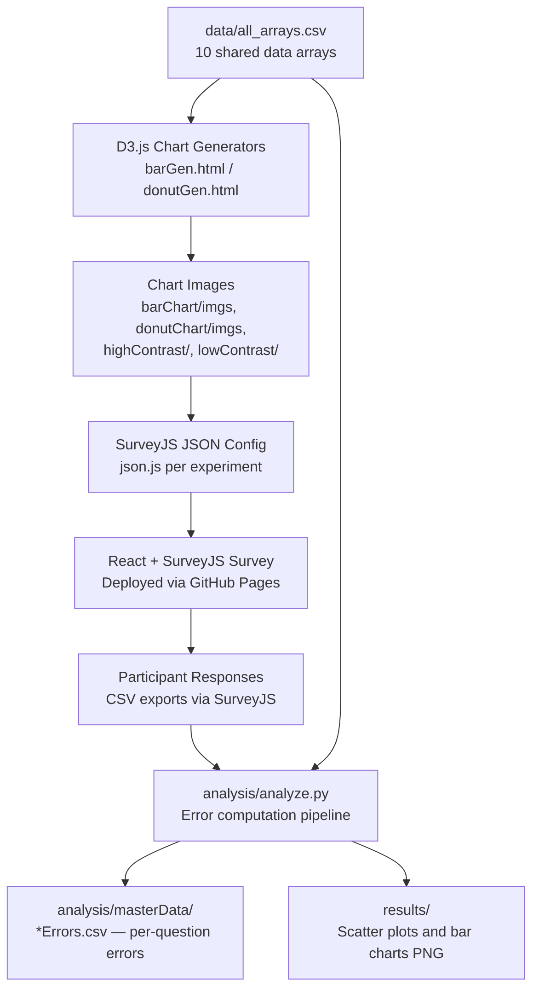

# Data Visualization Perception Study

**Does chart type or color contrast affect how accurately people estimate numerical differences?** This research project answers that question empirically — deploying three browser-based perceptual experiments, collecting participant data, and running statistical analysis using the Cleveland & McGill (1984) error metric.

---

## The "Why"

Data visualization is everywhere, but the design choices behind charts are rarely tested rigorously. Researchers Cleveland & McGill established in 1984 that chart type significantly impacts perceptual accuracy — but what about color contrast? And do different chart types (bar, radar, donut) produce meaningfully different error rates?

This study extends those foundational experiments by:
- Testing **three chart types** (bar, radar, donut) with matched datasets
- Varying **color contrast** (high-contrast blue vs. low-contrast orange) within each survey
- Using the **same 10 data arrays** across all three experiments to enable fair comparison

---

## Tech Stack

| Category | Technology | Why |
|---|---|---|
| **Visualization Generation** | D3.js v7 | Full SVG control for precise manipulation of color, geometry, and data markers |
| **Survey Frontend** | React + SurveyJS | Declarative survey definitions via JSON; handles image embedding and response capture without a backend |
| **Statistical Analysis** | Python, pandas, NumPy | Vectorized error computation and CSV I/O across hundreds of participant responses |
| **Result Visualization** | Matplotlib | Scatter plots with linear regression overlays to compare error vs. dataset standard deviation |
| **Deployment** | GitHub Pages | Zero-config static hosting; each experiment is an independent deployable page with a QR code |

---

## Key Features

- **Three independent survey experiments** — `barExperiment/`, `radarExperiment/`, `donutExperiment/` — each a self-contained React + SurveyJS app deployed to GitHub Pages
- **Controlled visual stimuli** — 10 chart pairs per survey, one low-contrast (orange), one high-contrast (blue), all generated from the same underlying 10 data arrays using D3.js
- **Cleveland/McGill error metric** — participant error is computed as `log₂(|judged − true| + ⅛)`, matching the formula from the seminal 1984 paper for cross-study comparability
- **Automated analysis pipeline** — `analysis/analyze.py` reads raw CSV exports, computes per-question errors, averages across participants, and renders result plots in a single run
- **Cross-chart-type comparison** — the same 10 data arrays are used for all three chart types, so differences in error are attributable to chart design, not data variance

---

## Architecture



---

## Results Summary

### Bar Chart
| Condition | Average Error |
|---|---|
| High Contrast (Blue) | 3.989 |
| Low Contrast (Orange) | 4.034 |

Bar charts produced the **lowest error rates** of all three chart types, confirming Cleveland & McGill's finding that position-based encodings are the most accurately perceived.


### Radar Chart
| Condition | Average Error |
|---|---|
| High Contrast (Blue) | 4.034 |
| Low Contrast (Orange) | 3.935 |

Radar charts performed comparably to bar charts. Notably, low-contrast charts showed *lower* error — a result that challenges the intuitive assumption that contrast aids accuracy.


### Donut Chart
| Condition | Average Error |
|---|---|
| High Contrast (Blue) | 4.378 |
| Low Contrast (Orange) | 4.490 |

Donut charts had the **highest error** of all three types, consistent with the difficulty of estimating angular/arc proportions relative to linear position.


**Key finding:** Color contrast had minimal and inconsistent impact on perceptual accuracy. Chart type was the dominant factor.

---

## Project Structure

```
.
├── data/
│   └── all_arrays.csv          # 10 shared input arrays used across all experiments
├── barChart/                   # Generated bar chart images (blue + orange variants)
├── donutChart/                 # Generated donut chart images
├── highContrast/               # High-contrast radar chart images
├── lowContrast/                # Low-contrast radar chart images
├── barExperiment/              # React+SurveyJS app for bar chart survey
├── donutExperiment/            # React+SurveyJS app for donut chart survey
├── radarExperiment/            # React+SurveyJS app for radar chart survey
├── analysis/
│   ├── fns.py                  # Pure utility functions (error metric, std dev)
│   ├── process.py              # DataFrame-level processing and matplotlib output
│   ├── analyze.py              # Entry point: orchestrates all three chart analyses
│   └── masterData/             # Raw CSV exports from SurveyJS + computed errors
└── results/                    # Output PNG charts from analysis pipeline
```

---

## Running the Analysis

**Requirements:** Python 3.10+, pandas, numpy, matplotlib

```bash
cd analysis
pip install pandas numpy matplotlib
python analyze.py
```

Output PNGs are written to `results/`. To re-enable specific plots, uncomment the relevant `pc.viz()` or `pc.createBarChart()` calls in `analyze.py`.

**Running a survey experiment locally:**

```bash
cd barExperiment   # or donutExperiment / radarExperiment
npm install
npm start
```

---

## Challenges & Solutions

### Challenge: Implementing the Cleveland/McGill Error Metric Correctly

The 1984 Cleveland & McGill paper defines perceptual error as:

```
error = log₂(|judged − true| + ⅛)
```

The `+ ⅛` term is easy to overlook. It serves two purposes: (1) it prevents `log₂(0)` when a participant's answer is exactly correct, and (2) it compresses large outlier errors, making the metric more robust to wild guesses. Matching this formula exactly was necessary to compare our results to prior work — a small constant makes results incomparable across studies.

**Implementation** (`analysis/fns.py:22`):
```python
score = math.log2(abs(j - t) + 1/8)
```

### Challenge: Ordering Bias in the Survey Design

Each survey presented low-contrast charts on page 1 and high-contrast charts on page 2. Because participants saw the same underlying data twice, familiarity with the dataset on page 2 may have inflated high-contrast accuracy — which could partially explain why high-contrast didn't consistently outperform low-contrast as hypothesized.

A future study would randomize the order of contrast conditions across participants.

### Challenge: Cross-Device Response Variability

Participants completed surveys on both phones and computers. Mobile viewport sizes made the chart images smaller and the numeric input fields harder to use precisely. This added noise to the dataset that wasn't present in controlled lab settings.

---

## Conclusion

**Bar charts are the most perceptually accurate chart type** for estimating numerical differences, consistent with decades of prior work. Donut charts were the least accurate. Surprisingly, **color contrast had minimal effect** — users performed similarly with both orange and blue encodings across all three chart types. Shorter surveys (20 questions vs. prior A3's longer format) did not meaningfully reduce error rates for bar or radar charts, though donut chart errors were notably lower than in the prior study.

---

## Team

| Contributor | Role |
|---|---|
| Taya | Statistical analysis pipeline, bar chart generation, bar chart data collection |
| Myles | Radar chart generation, survey implementation, data collection, website, screencast |
| Ash | Donut chart generation, donut chart data collection |

---

## References

- Cleveland, W. S., & McGill, R. (1984). Graphical perception: Theory, experimentation, and application to the development of graphical methods. *Journal of the American Statistical Association*, 79(387), 531–554.
- [D3.js](https://d3js.org/) — Data-Driven Documents
- [SurveyJS](https://surveyjs.io/) — Survey library for React
